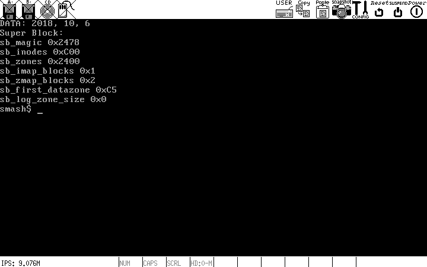

# SMASH

## 简介

smash是一个类Unix的内核，实现了基于分段和分页的内存管理，单个进程最大4GB虚拟地址空间，支持minix-v2l文件系统，实现了写实复制(fork)，管道等机制。



## 开发环境

* Ubuntu 18.04
* gcc 7.4.0
* bochs-x 2.6.5+
* cmake 3.0+

## 编译内核

```sh
cd smash/_build
cmake ../
make
```

## 制作根文件系统

要运行内核，首先需要在_build目录下，创建一块虚拟磁盘，具体创建方法如下，你也可以直接[下载](https://pan.baidu.com/s/1w8Xrc3vILAlCCl2TACJGXg)

* 下载的童鞋可以跳过第1步和第3步

### 1. 创建虚拟磁盘和minix-v2分区

```sh
# 创建一个10M的空文件
dd if=/dev/zero of=hd.img bs=1M count=10
# 创建一个loop设备
sudo losetup /dev/loop0 hd.img
# 对loop设备进行分区：增加一个主分区,分区号为1
sudo fdisk /dev/loop0
# 刷新loop设备的分区表
sudo partprobe /dev/loop0
# 将第一个分区格式化为minix v2文件系统
sudo mkfs.minix -2 /dev/loop0p1
# 挂载第一个分区
sudo mount /dev/loop0p1 /mnt
# 创建dev和bin目录
sudo mkdir /mnt/dev /mnt/bin
# 创建tty设备节点
sudo mknod /mnt/dev/tty c 1 1
```

### 2. 安装内核

在_build目录下执行make命令

```sh
make
```

* make完成后内核代码就会被写入虚拟磁盘

### 3. 安装用户工具

* 在_build/usr目录下有bash, ls, cat, echo, rm等可执行文件
* 这些可执行文件需要手动拷贝到虚拟磁盘的`/bin`目录

```sh
# 拷贝可执行文件
cd usr
sudo cp bash ls cat echo rm /mnt/bin
```

### 3. 运行

在_build目录下执行

```sh
bochs -q -f bochsrc
```

## 系统调用一览

```c
extern int exit(int code);
extern int fork(void);
extern int read(int fd, char *buf, int count);
extern int write(int fd, const char *buf, int count);
extern int open(const char *pathname, int flags, int mode);
extern int close(int fd);
extern int waitpid(int pid, int *status, int options);
extern int creat(const char *pathname, int mode);
extern int link(const char *oldpath, const char *newpath);
extern int unlink(const char *pathname);
extern int execve(const char *pathname, char *const argv[], char *const envp[]);
extern int chdir(const char *pathname);
extern int mkdir(const char *pathname, int mode);
extern int rmdir(const char *pathname);
extern int pause(void);
extern int getpid(void);
extern int pipe(int fd[2]);
extern int dup(int fd);
```

## 参考

* [Linux内核完全剖析:基于0.12内核](https://book.douban.com/subject/3229243/)
* [The Design of the UNIX Operating System](https://book.douban.com/subject/1768601/)
* [wiki.osdev.org](http://wiki.osdev.org/Main_Page)
* [MIT 6.828 xv6](http://pdos.csail.mit.edu/6.828/2011/xv6.html)
* [386BSD](https://github.com/dspinellis/unix-history-repo)
* [INTEL 80386 PROGRAMMER'S REFERENCE MANUAL](https://css.csail.mit.edu/6.858/2014/readings/i386.pdf)
* [minix3](http://www.minix3.org/)

## License

* MIT License

## 一些细节

### 文件夹

* boot : 存放引导程序
* commom : 存放基础数据结构,算法
* kernel : 内核代码
* usr : 应用程序

### kernel设计

### CMake

* 使用config.h.in来生成配置选项

### GCC

* 不使用标准库的头文件(用自定义的): -nostdinc

### Bochs

* IO debugger : 在bochsrc中添加"port_e9_hack: enabled=1"
* GUI Debug : 安装libgtk2.0-dev, 然后添加编译选项--enable-debugger --enable-disasm --enable-debugger-gui,编译bochs. 然后在bochsrc中添加"display_library: x, options="gui_debug""
